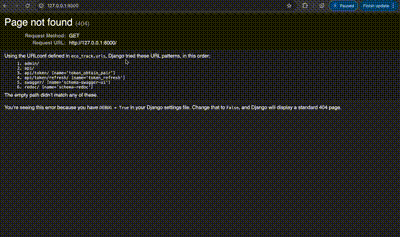

# Task: Developing an Air Quality Monitoring API

**Customer company:** EcoTrack

## Brief Description

EcoTrack is developing a platform for monitoring and managing environmental data from various sensors and devices. This task involves creating a RESTful API that manages air quality sensors. The API will support CRUD (Create, Read, Update, Delete) operations for managing sensor data, air quality readings, and alerts, and will be protected by JWT authentication. The system must be able to handle simultaneous requests and ensure data consistency and security.

### Key Features:
- CRUD operations for managing air quality sensors and their associated data (e.g., PM2.5, PM10, CO2 levels).
- JWT-based authentication and authorization for secured access.
- Well-documented API using Swagger/OpenAPI for easy integration.
- Role-based access control (optional) to manage different user roles (e.g., Admin, Operator).
- Error handling with appropriate HTTP status codes.
- Support for horizontal scalability and high availability.

## Additional Requirements:
- The API must support standard HTTP methods: GET, POST, PUT, DELETE.
- Implement error handling with appropriate HTTP statuses and descriptive messages.
- The system should maintain high performance with support for caching and optimized database queries.
- Data consistency should be maintained for parallel requests, particularly during sensor data creation, updates, and deletion.
- Detailed API documentation should be provided using Swagger or OpenAPI.

## Restrictions:
- Ensure that sensitive API endpoints are only accessible by authenticated users with valid JWT tokens.
- Data should be handled securely, and only authenticated users should have access to critical operations like data creation and deletion.
- The API should be able to scale to handle large numbers of simultaneous requests without sacrificing performance.

## Answers to Possible Questions:

1. **Q: How will users be authenticated?**  
   **A:** Authentication will be handled using JSON Web Tokens (JWT). Users must first log in via the `/api/token/` endpoint to receive a token, which must then be included in the Authorization header for further requests.

2. **Q: What measures will ensure high performance?**  
   **A:** We will use caching for commonly accessed data (like sensor info) and optimize database queries using `select_related` and `prefetch_related`. Horizontal scaling can also be implemented to handle high traffic.

3. **Q: How will the API handle data consistency in concurrent operations?**  
   **A:** We will use database transactions to ensure consistency when creating, updating, or deleting sensor data. This ensures that changes will either complete fully or not at all, even when multiple clients access the system simultaneously.

4. **Q: What data format will the API use?**  
   **A:** The API will use JSON format for both request and response bodies as it is widely supported and easy to integrate with various platforms.

---

## How it works (GIF)

### 1.  


## Setup Instructions

Follow these instructions to run the project locally:

1. **Clone the repository:**
   ```bash
   git clone https://github.com/your-username/EcoTrack-Air-Quality-Sensors-API.git
   cd EcoTrack-Air-Quality-Sensors-API

2. **Set up a virtual environment and install dependencies:**
   ```bash
    python -m venv venv
    source venv/bin/activate  # On Windows: venv\Scripts\activate
    pip install -r requirements.txt

3. **Run migrations to set up the database:**
   ```bash
   python manage.py migrate

4. **Create a superuser to access the admin panel:**
   ```bash
   python manage.py createsuperuser
5. **Start the Django development server:**
   ```bash
   python manage.py runserver

6. **Start the Django development server:**
   ```bash
   http://127.0.0.1:8000/api/

6. **Swagger API Documentation: Swagger-generated API documentation is available at:**
   ```bash
   http://127.0.0.1:8000/swagger/


## Technologies Used
    - Django: For developing the web framework and API.
    - Django REST Framework: For building the RESTful API.
    - JWT Authentication: For secure authentication.
    - Swagger/OpenAPI: For API documentation.
    - PostgreSQL: For the database (can be swapped with SQLite for local testing).


